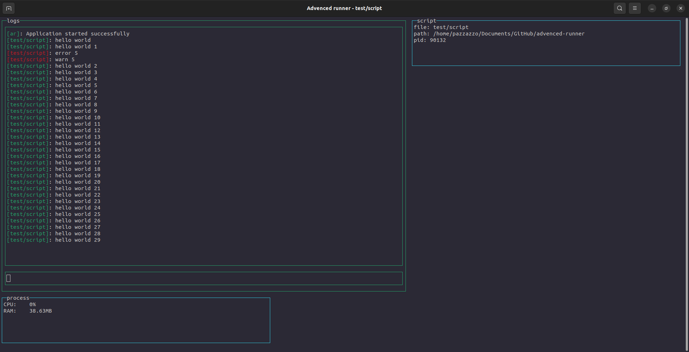

# Advenced runner
A process manager for node js with advenced cli



## Install

``` bash
$ npm install -g advenced-runner
```

## How to use

| For             |         Use         |
|-----------------|---------------------|
| Start a program | `ar start {script}` |

## Exemple

This will make a log every second, an error and a warn after 2 seconds as well as a log at each input

``` js
console.log("hello world");

let i = 0

setInterval(() => {
    //log every seconds "hello world" and this id 
    i++
    console.log("hello world " + i);
}, 1000);

setTimeout(() => {
    //log a error with code 5 and a warn with code 5
    console.error("error", 5)
    console.warn("warn", 5)
}, 2000);

process.stdin.on("data", (data) => {
    //log the written data
    console.log("new input! (" + data + ")");
})
```